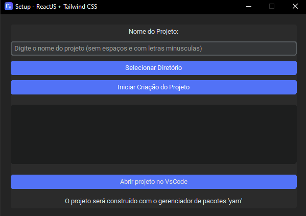

# Setup - ReactJS + Tailwind CSS
Ferramenta para criação e configuração de projetos **ReactJS** com **Tailwind CSS**, com interface gráfica. Permite iniciar novos projetos rapidamente com as dependências necessárias e remove arquivos desnecessários, garantindo um projeto limpo e organizado desde o início.

## Funcionamento
*  **Seleção de Projeto:** O usuário escolhe o local para criar o novo projeto.
*  **Criação do Projeto:** A ferramenta utiliza comandos do terminal para gerar a estrutura básica do projeto React.
*  **Configuração do Tailwind CSS:** Configura automaticamente o Tailwind CSS, incluindo a instalação das dependências necessárias.
*  **Remoção de Arquivos Desnecessários:** Apaga pastas e arquivos que não são essenciais, mantendo o projeto organizado.
*  **Acesso ao VSCode:** Um botão permite abrir o projeto diretamente no Visual Studio Code, facilitando o início do desenvolvimento.

## Como utilizar?
Para utilizar o projeto, execute o arquivo "Setup - ReactJS + Tailwind" na pasta `dist`.

## Observação
O projeto utiliza o gerenciador de pacotes `yarn` para criação do projeto, caso não tenha instalado na sua máquina, ele será instalado após iniciar o software.
