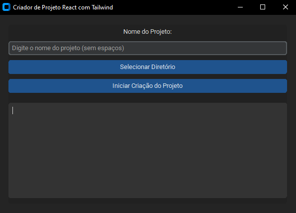

# Criador de Projetos React com Tailwind CSS 

  

Este projeto é uma ferramenta prática desenvolvida em Python que facilita a criação e configuração de projetos React com Tailwind CSS. Com uma interface gráfica intuitiva, você pode rapidamente iniciar um novo projeto com todas as configurações e dependências necessárias para começar a desenvolver com React e Tailwind CSS. 

## 🎯 Objetivo 
O principal objetivo deste projeto é transformar a configuração inicial de projetos React com Tailwind CSS em um processo simples e ágil. Criar um projeto React e configurar Tailwind CSS manualmente pode ser demorado e tedioso, especialmente para desenvolvedores que desejam começar rapidamente. A ferramenta automatiza essas etapas, proporcionando uma maneira eficiente e livre de erros para criar e configurar novos projetos. A automação não só economiza tempo, mas também reduz a possibilidade de erros humanos durante a configuração, permitindo que você se concentre no desenvolvimento do seu aplicativo.

## 📋 Funcionalidades

- **Criação de Projeto React**: 
  - Utiliza Vite para criar um novo projeto React com a estrutura padrão.

- **Instalação de Tailwind CSS**: 
  - Configura Tailwind CSS junto com PostCSS e Autoprefixer.

- **Configuração Automática**: 
  - Inicializa e configura os arquivos `tailwind.config.js` e `postcss.config.js`.

- **Arquivos de Exemplo**: 
  - Substitui arquivos padrão por configurações de exemplo e remove arquivos desnecessários.

- **Interface Gráfica Intuitiva**: 
  - Uma interface gráfica desenvolvida com CustomTkinter para facilitar a criação do projeto.

## 🤔 Como utilizar? 
Para utilizar o projeto, execute o arquivo "Criador de Projetos React com Tailwind" na pasta `dist`. 

## Observação
O projeto utiliza `yarn` para criação do projeto, caso não utlize yarn, rode o comando `npm install -g yarn` antes de executar a aplicação.
